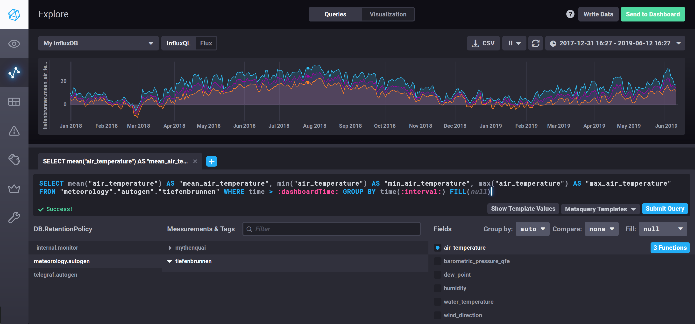

# Weather Station

## TICK Stack Installation

### Raspberry Pi

#### System Tuning

[Enable ZRAM](https://github.com/novaspirit/rpi_zram) and disable Swap

```bash
sudo wget -O /usr/bin/zram.sh https://raw.githubusercontent.com/novaspirit/rpi_zram/master/zram.sh
sudo chmod +x /usr/bin/zram.sh
# add as second last line (before exit 0)
sudo sed -i "`wc -l < /etc/rc.local`i\\/usr/bin/zram.sh &\\" /etc/rc.local
sudo shutdown -r now
```

Alternatively, [increase Swap](https://wpitchoune.net/tricks/raspberry_pi3_increase_swap_size.html) and set swappiness as low as possible

```bash
sudo dphys-swapfile swapoff
echo "CONF_SWAPSIZE=1024" | sudo tee -a /etc/dphys-swapfile
echo "vm.swappiness = 1" | sudo tee -a /etc/sysctl.conf
sudo dphys-swapfile swapon
sudo shutdown -r now
```

#### TICK Installation Native

Please follow [this procedure](https://www.influxdata.com/blog/running-the-tick-stack-on-a-raspberry-pi/) to install the TICK stack on your Raspberry Pi.

```bash
curl -sL https://repos.influxdata.com/influxdb.key | sudo apt-key add -
# make sure you use the correct version name (stretch)
echo "deb https://repos.influxdata.com/debian stretch stable" | sudo tee /etc/apt/sources.list.d/influxdb.list
sudo apt-get install influxdb 
# install these if needed
sudo apt-get install telegraf chronograf kapacitor
```

#### TICK Installation using Docker 

##### Docker Installation 

See also [here](https://blog.docker.com/2019/03/happy-pi-day-docker-raspberry-pi)

```bash
sudo apt-get update
sudo apt-get install apt-transport-https ca-certificates software-properties-common -y
curl -fsSL get.docker.com -o get-docker.sh && sh get-docker.sh
sudo usermod -aG docker pi
sudo curl https://download.docker.com/linux/raspbian/gpg
echo "deb https://download.docker.com/linux/raspbian/ stretch stable" | sudo tee -a etc/apt/sources.list
sudo apt-get update
sudo apt-get upgrade
rm get-docker.sh
sudo systemctl start docker.service
sudo usermod -a -G docker $USER
# restart your system (prevents later issues in case a kernel update took place - exit and login might not be enough)
docker info
```

##### Docker-Compose Installation

See also [here](https://jonathanmeier.io/install-docker-and-docker-compose-raspberry-pi/)

```bash
curl https://bootstrap.pypa.io/get-pip.py -o get-pip.py && sudo python3 get-pip.py
rm get-pip.py
sudo pip3 install docker-compose
```

##### Sandbox Installation

[Sandbox](https://github.com/influxdata/sandbox) provides a TICK Stack that runs with Docker.

```bash
mkdir git && cd git
git clone https://github.com/influxdata/sandbox.git
./sandbox up
```

## Load Weather Data

This challenge uses the weather data provided by the [Wasserschutzpolizei Zurich](https://data.stadt-zuerich.ch/dataset/sid_wapo_wetterstationen).
The [weatherstation-api package](https://pypi.org/project/fhnw-ds-hs2019-weatherstation-api/) provides the means to read historic and live data.

## Visualize Data

### Chronograf

The TICK Stack comes with Chronograf. It runs on `http://localhost:8888` and provides the possibility to visualize data. 



In order to get started you can import this simple [Dashboard](dashboard/Simple_Dashboard.json)

Otherwise use following procedure:
- Dashboards -> Create Dashbord
- Add Data
- Select "meteorology.autogen" -> mythenquai -> air_temperature
- Make sure you select a large enough duration (e.g. "Past 30d")
- You might want to add a second query (e.g. for "tiefenbrunnen")

